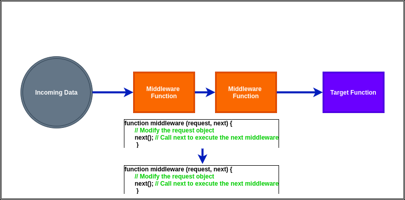
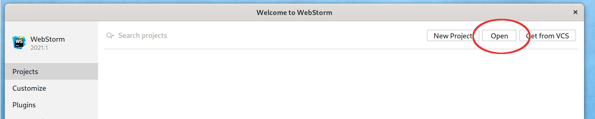
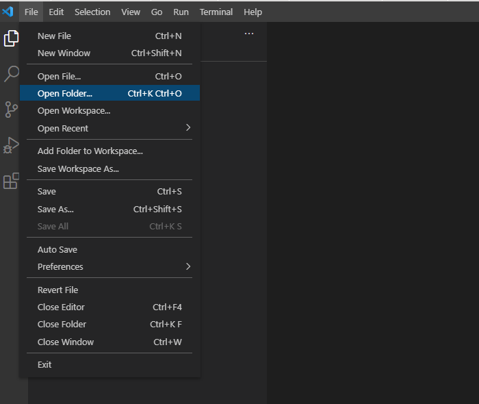

# nodeTips Project

Modular Project with tips & demos  ;)

#### Running the examples

You can run the examples executing by command line or through our favourite IDE.

By command line, execute (platform independent):
``` 
 node [nameFileJS]
```
or, if you prefer
```
 nodemon [nameFileJS
```

Designed for development, **Nodemon** is a utility that will monitor for any changes in your source and 
automatically restart your server. Your process will automatically restart when your code changes.
Visit [Nodemon Official Web Page](https://nodemon.io).


### Modules

+ [Template Literals](samples/template-literals.js)
+ [Arrow Functions](samples/arrow-function.js)
+ [Timeout](samples/timeout.js)
+ Inheritance. Prototype (ES5) vs Classes (ES6)
+ **Middleware Pattern**.
  - This sample explain how it works this pattern, as you can see in next image:
    
+ Factory Pattern.

### Import project for use with WebStorm

Follow the steps below:
* Clone the project from the Github Platform. Execute:
  ```
  git clone [url project]
  ```
* Open the project downloaded.
  


### Import project for use with Visual Studio Code

Follow the steps below:
* Clone the project from the Github Platform. Execute:
  ```
  git clone [url project]
  ```
* Open the project downloaded.
  


[](code_of_conduct_EN.md) 
 [](code_of_conduct_ES.md) 
  [](code_of_conduct_CA.md) 
